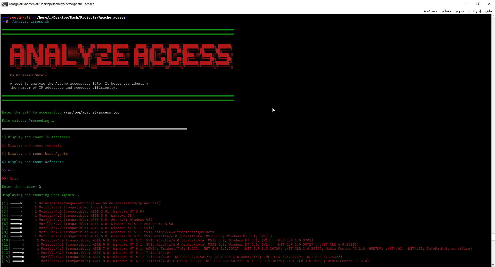

# Analyze-Access

Analyze-Access is a powerful and efficient Bash script designed to analyze Apache access.log files. The tool extracts and displays useful information from the logs, including IP addresses, requests, user agents, and referrers. Whether you're a system administrator, security analyst, or web developer, Analyze-Access helps you quickly identify trends, track visitors, and detect potential issues in your Apache server logs.





## 🚀 Features

- 📊 **Display and count unique IP addresses**: Identify unique visitors and their frequency.  
- 🔍 **Analyze request types and methods**: Understand the types of requests being made (GET, POST, etc.).  
- 🖥️ **Identify and count User-Agents**: Detect the browsers and devices accessing your server.  
- 🌍 **Extract and analyze referrer sources**: Track where your traffic is coming from.  
- 🎨 **Color-coded output**: Enhanced readability with color-coded terminal output.  
- 🔄 **Interactive menu-driven interface**: Easy-to-use interface for seamless navigation.  


## 📥 Installation

To get started with **Analyze-Access**, follow these steps:

### Prerequisites
Make sure you have the following installed on your system:

- 🖥️ **Bash** (typically pre-installed on most Linux systems)  
- 📂 **Access to an Apache `access.log` file** to analyze  

### Step-by-Step Installation

1. **Clone the repository:**
   ```bash
   git clone https://github.com/0xgbreil/Analyze-Access.git
   ```
2. **🔧 Navigate to the project directory:**
   ```bash
   cd Analyze-Access
   ```
3. **🛠 Make the script executable:**
   ```bash
   chmod +x analyze-access.sh
   ```

4. **🚀 Run the script:**
   ```bash
   ./analyze-access.sh
   ```

# 🛠 Usage

After running the script, you will be presented with an interactive menu. Here's how to use it:

1. Select an option from the menu to analyze specific parts of the access.log file.

2. View the results directly in your terminal.

```bash
Example:

Enter the path to access.log: /var/log/apache2/access.log
File exists. Proceeding...

==========================================================================================

1) Display and count IP addresses

2) Display and count requests

3) Display and count User Agents

4) Display and count Referrers

5) All

99) Exit

Enter the number: 
```

# 🙏 Acknowledgments

- Special thanks to the open-source community for inspiration and support.
- This tool was developed to simplify Apache log analysis for system administrators and developers.

 


 
  
طدد
