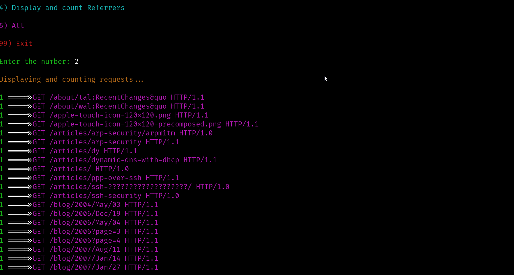

# Analyze-Access

Analyze-Access is a powerful and efficient Bash script designed to analyze Apache access.log files. The tool extracts and displays useful information from the logs, including IP addresses, requests, user agents, and referrers. Whether you're a system administrator, security analyst, or web developer, Analyze-Access helps you quickly identify trends, track visitors, and detect potential issues in your Apache server logs.





## Features

- **IP Analysis**: Counts and displays unique IP addresses in the log file.
- **Request Analysis**: Displays and counts unique HTTP requests.
- **User Agent Analysis**: Identifies and counts different user agents accessing the server.
- **Referrer Analysis**: Displays and counts referrers to track the origin of traffic.

## Installation

To get started with `analyze-access`, follow these steps:

### Prerequisites

Make sure you have the following installed on your system:
- **Bash** (typically pre-installed on most Linux systems)
- **Access to an Apache `access.log` file** to analyze

### Step 1: Clone the repository

Clone the repository to your local machine using Git:

```bash
https://github.com/0xgbreil/Analyze-Access.git
cd analyze-access
